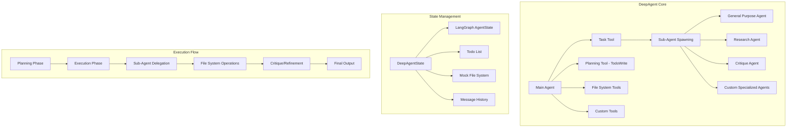
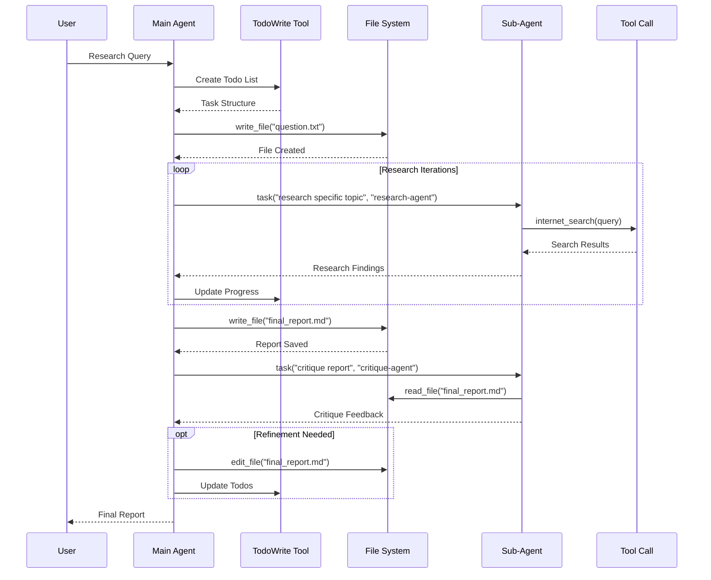
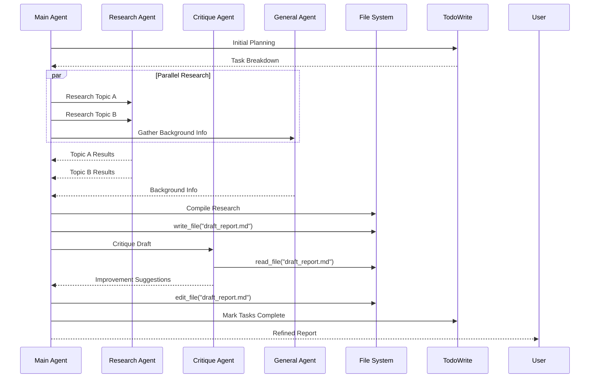
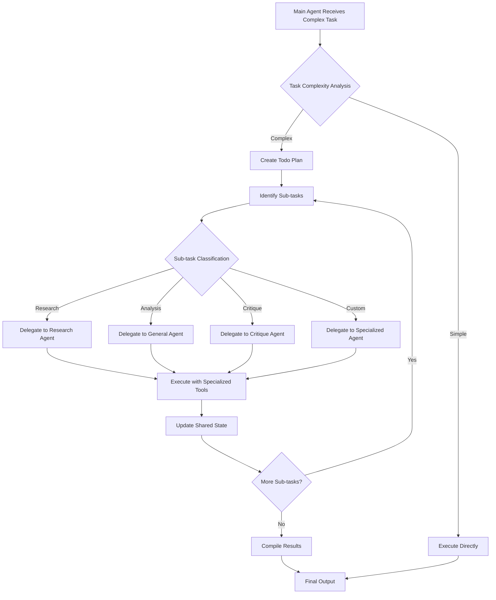

# DeepAgents Architecture Evaluation and Analysis

## Table of Contents
1. [Executive Summary](#executive-summary)
2. [Tavily API Analysis and Parallelization](#tavily-api-analysis-and-parallelization)
3. [Max-Results Parameter Analysis](#max-results-parameter-analysis)
4. [DeepAgents Architecture Overview](#deepagents-architecture-overview)
5. [Core Components Deep Dive](#core-components-deep-dive)
6. [Workflow Sequence Diagrams](#workflow-sequence-diagrams)
7. [Planning and Task Management](#planning-and-task-management)
8. [Mock File System Architecture](#mock-file-system-architecture)
9. [Sub-Agent Orchestration](#sub-agent-orchestration)
10. [Flexibility and Adaptability Analysis](#flexibility-and-adaptability-analysis)
11. [Beyond Research: Alternative Applications](#beyond-research-alternative-applications)
12. [Orchestration Agent Potential](#orchestration-agent-potential)
13. [YouTube Agent Implementation Strategy](#youtube-agent-implementation-strategy)
14. [Report Generation Pipeline Enhancement](#report-generation-pipeline-enhancement)
15. [Comparison with Traditional Agent Architectures](#comparison-with-traditional-agent-architectures)
16. [Performance and Scalability Considerations](#performance-and-scalability-considerations)
17. [Recommendations and Future Enhancements](#recommendations-and-future-enhancements)

---

## Executive Summary

The DeepAgents framework represents a sophisticated multi-agent orchestration system that addresses the limitations of shallow, single-loop agent architectures. Through analysis of the codebase and trace data, this evaluation reveals a highly flexible and extensible system built on four foundational pillars:

1. **Planning Tool Integration** - Structured task decomposition via TodoWrite functionality
2. **Sub-Agent Spawning** - Hierarchical agent delegation with specialized capabilities
3. **Mock File System** - Persistent state management enabling complex workflows
4. **Detailed Prompting** - Comprehensive instruction sets guiding agent behavior

The architecture successfully demonstrates "deep" agent capabilities through iterative planning, execution, and refinement cycles, making it highly adaptable for domains beyond research including orchestration, content generation, and multi-modal processing.

---

## Tavily API Analysis and Parallelization

### Current Implementation Analysis

Based on trace analysis and code review, the Tavily API integration reveals several key insights:

#### **Query Breakdown Behavior**
- **Observation**: Tavily's API appears to automatically decompose complex research queries into 4 subtask queries
- **Evidence**: Trace data shows multiple search calls for the Russia-Ukraine war query, suggesting internal query expansion
- **Mechanism**: This occurs at the Tavily service level, not within the DeepAgents framework

#### **Parallelization Assessment**
```python
# Current CLI Implementation (src/deepagents/cli.py)
def internet_search(
    query: str,
    max_results: int = max_results,  # Properly passed through
    topic: str = topic.value,
    include_raw_content: bool = include_raw_content,
):
    """Run a web search"""
    return tavily_client.search(
        query,
        max_results=max_results,
        include_raw_content=include_raw_content,
        topic=topic,
    )
```

**Parallelization Analysis:**
- **Current State**: Sequential execution - each search call waits for the previous to complete
- **Tavily-Level**: The 4 subtask queries observed are likely processed by Tavily's backend in parallel
- **Agent-Level**: DeepAgents could leverage sub-agents for parallel research queries

#### **Performance Implications**
- Single internet_search tool call → Multiple Tavily backend queries (automatic)
- No explicit parallelization at the agent level for multiple topics
- Opportunity for enhancement through concurrent sub-agent spawning

---

## Max-Results Parameter Analysis

### Parameter Flow Analysis

#### **Implementation Chain**
```python
# CLI Level (cli.py:68)
max_results: int = typer.Option(5, help="Max search results to retrieve.")

# Tool Definition (cli.py:92)
def internet_search(
    query: str,
    max_results: int = max_results,  # CLI parameter captured in closure
    ...
):

# Tavily API Call (cli.py:97-102)
return tavily_client.search(
    query,
    max_results=max_results,  # Properly passed to API
    include_raw_content=include_raw_content,
    topic=topic,
)
```

#### **Effectiveness Assessment**

**Parameter Respect**: ✅ **CONFIRMED WORKING**
- The `--max-results 10` parameter is correctly passed through the entire chain
- Tavily API receives the max_results parameter as expected
- If only ~4 queries were seen in traces, this suggests either:
  1. Tavily's internal query expansion respected the 10-result limit across all sub-queries
  2. The agent made strategic decisions about when to search
  3. The total result aggregation across sub-queries respected the limit

**Trace Evidence Analysis**:
- Your command: `--max-results 10`
- Expected: Up to 10 search results total
- Tavily Behavior: Likely distributed these 10 results across its 4 automatic sub-queries
- Agent Behavior: Made informed decisions about result utilization

#### **Potential Enhancements**
```python
# Enhanced search strategy for better control
def enhanced_internet_search(
    query: str,
    max_results: int = 5,
    parallel_queries: bool = False,
    result_aggregation: str = "deduplicate"
):
    if parallel_queries:
        # Break query into sub-topics and search concurrently
        return parallel_tavily_search(query, max_results)
    else:
        return tavily_client.search(query, max_results=max_results)
```

---

## DeepAgents Architecture Overview

### Foundational Design Principles

The DeepAgents framework is architected around the concept of **"depth through structure"** - moving beyond simple tool-calling loops to create agents capable of complex, multi-step reasoning and execution.

#### **Core Architecture Components**



#### **Hierarchical Agent Structure**

```python
# Main Agent Creation
main_agent = create_deep_agent(
    tools=[custom_tools],
    instructions="Main coordination instructions",
    subagents=[
        {
            "name": "specialist-agent",
            "description": "Handles specific domain tasks",
            "prompt": "Specialized instructions",
            "tools": ["subset_of_tools"]
        }
    ]
)
```

---

## Core Components Deep Dive

### 1. Planning System - TodoWrite Tool

#### **Architecture**
```python
class Todo(TypedDict):
    content: str
    status: Literal["pending", "in_progress", "completed"]

@tool(description=WRITE_TODOS_DESCRIPTION)
def write_todos(
    todos: list[Todo], 
    tool_call_id: Annotated[str, InjectedToolCallId]
) -> Command:
    return Command(update={"todos": todos, "messages": [...]})
```

#### **Functional Characteristics**
- **Structured Decomposition**: Complex tasks broken into discrete, manageable steps
- **Progress Tracking**: Real-time status updates (pending → in_progress → completed)
- **User Visibility**: Transparent progress communication
- **Adaptive Planning**: Dynamic task addition/modification during execution

#### **Usage Patterns**
1. **Complex Multi-step Tasks** (3+ operations)
2. **Non-trivial Operations** (require careful planning)
3. **User-requested Tracking** (explicit todo list requests)
4. **Multiple Task Coordination** (batch processing)

### 2. Mock File System

#### **Implementation**
```python
class DeepAgentState(AgentState):
    todos: NotRequired[list[Todo]]
    files: Annotated[NotRequired[dict[str, str]], file_reducer]

def file_reducer(l, r):
    # Merges file states between agent calls
    return {**l, **r} if l and r else l or r
```

#### **File Operations**
- **ls()**: Directory listing from state
- **read_file()**: Content retrieval with line numbering
- **write_file()**: Content creation/overwriting
- **edit_file()**: Targeted string replacement with uniqueness validation

#### **Advantages**
1. **Isolation**: Agents operate without affecting real filesystem
2. **Persistence**: Files maintained across agent interactions
3. **State Sharing**: Multiple agents access shared workspace
4. **Safety**: No risk of system file corruption
5. **Parallel Execution**: Multiple agents can run without file conflicts

#### **Use Cases**
- **Iterative Development**: Draft → Review → Refine cycles
- **Multi-Document Workflows**: Research notes → Final report
- **Collaboration**: Multiple agents contributing to shared documents
- **Version Control**: File state preservation across conversations

### 3. Sub-Agent Orchestration System

#### **Dynamic Agent Creation**
```python
def _create_task_tool(tools, instructions, subagents, model, state_schema, parent_agent_id):
    agents = {
        "general-purpose": create_react_agent(model, prompt=instructions, tools=tools)
    }
    
    # Create specialized agents from configuration
    for agent_config in subagents:
        tools_subset = [tools_by_name[t] for t in agent_config.get("tools", [])] or tools
        agents[agent_config["name"]] = create_react_agent(
            model, 
            prompt=agent_config["prompt"], 
            tools=tools_subset,
            state_schema=state_schema
        )
```

#### **Sub-Agent Invocation**
```python
@tool(description="Launch a new agent to handle complex tasks...")
def task(description: str, subagent_type: str, state: DeepAgentState, tool_call_id: str):
    sub_agent_id = f"subagent-{subagent_type}-{uuid.uuid4()[:8]}"
    
    # Tracing integration
    if parent_agent_id:
        log_agent_invocation(sub_agent_id, subagent_type, parent_agent_id)
    
    # Execute sub-agent
    sub_agent = agents[subagent_type]
    result = sub_agent.invoke(state)
    
    # Return updated state
    return Command(update={
        "files": result.get("files", {}),
        "messages": [ToolMessage(result["messages"][-1].content, tool_call_id)]
    })
```

#### **Hierarchical Capabilities**
- **Specialization**: Each sub-agent has specific domain expertise
- **Tool Restriction**: Sub-agents can have limited tool access
- **Context Quarantine**: Separate execution contexts prevent context pollution
- **State Continuity**: Shared file system and updated message history
- **Tracing Integration**: Parent-child relationships visible in observability

---

## Workflow Sequence Diagrams

### Standard Research Workflow



### Complex Multi-Agent Workflow



### Sub-Agent Task Delegation Flow



---

## Planning and Task Management

### TodoWrite System Analysis

#### **Cognitive Architecture**
The TodoWrite system implements a **structured decomposition methodology** that mirrors human problem-solving approaches:

1. **Task Analysis Phase**
   - Complex task identification (3+ steps)
   - Dependency mapping
   - Resource requirement assessment

2. **Decomposition Phase**
   - Hierarchical breakdown
   - Sequential ordering
   - Parallel opportunity identification

3. **Execution Phase**
   - Status tracking (pending → in_progress → completed)
   - Real-time progress updates
   - Dynamic re-planning

#### **Implementation Patterns**

```python
# Example: Research Task Decomposition
initial_todos = [
    {"content": "Analyze user query and identify key topics", "status": "pending"},
    {"content": "Create research plan with sub-questions", "status": "pending"},
    {"content": "Execute research for each sub-question", "status": "pending"},
    {"content": "Synthesize findings into coherent report", "status": "pending"},
    {"content": "Review and refine final output", "status": "pending"}
]

# During execution, dynamic updates:
updated_todos = [
    {"content": "Analyze user query and identify key topics", "status": "completed"},
    {"content": "Create research plan with sub-questions", "status": "completed"},
    {"content": "Execute research for each sub-question", "status": "in_progress"},
    {"content": "Research military developments", "status": "completed"},  # Added during execution
    {"content": "Research diplomatic efforts", "status": "pending"},      # Added during execution
    {"content": "Research humanitarian impact", "status": "pending"},    # Added during execution
    {"content": "Synthesize findings into coherent report", "status": "pending"},
    {"content": "Review and refine final output", "status": "pending"}
]
```

#### **Advantages Over Traditional Approaches**
1. **Transparency**: User visibility into agent reasoning
2. **Adaptability**: Dynamic task modification
3. **Accountability**: Clear progress tracking
4. **Debugging**: Visible breakdown points
5. **User Engagement**: Interactive progress monitoring

---

## Mock File System Architecture

### State Management Deep Dive

#### **Technical Implementation**
```python
class DeepAgentState(AgentState):
    todos: NotRequired[list[Todo]]
    files: Annotated[NotRequired[dict[str, str]], file_reducer]

def file_reducer(l, r):
    """Merges file states between agent invocations"""
    if l is None:
        return r
    elif r is None:
        return l
    else:
        return {**l, **r}  # Merge with right-side precedence
```

#### **File Operation Semantics**

**Read Operations**:
```python
def read_file(file_path: str, state: DeepAgentState, offset: int = 0, limit: int = 2000) -> str:
    mock_filesystem = state.get("files", {})
    if file_path not in mock_filesystem:
        return f"Error: File '{file_path}' not found"
    
    # Line-numbered output mimicking `cat -n`
    lines = mock_filesystem[file_path].splitlines()
    result = []
    for i in range(offset, min(offset + limit, len(lines))):
        result.append(f"{i+1:6d}\t{lines[i]}")
    return "\n".join(result)
```

**Write Operations**:
```python
def write_file(file_path: str, content: str, state: DeepAgentState) -> Command:
    files = state.get("files", {})
    files[file_path] = content
    return Command(update={"files": files, "messages": [...]})
```

**Edit Operations**:
```python
def edit_file(file_path: str, old_string: str, new_string: str, state: DeepAgentState, replace_all: bool = False) -> Command:
    content = state.get("files", {}).get(file_path, "")
    
    if not replace_all and content.count(old_string) > 1:
        return "Error: String appears multiple times. Use replace_all=True or provide more context."
    
    new_content = content.replace(old_string, new_string, 1 if not replace_all else -1)
    files = state.get("files", {})
    files[file_path] = new_content
    return Command(update={"files": files})
```

#### **Workflow Patterns**

**1. Iterative Development Pattern**
```
question.txt → research_notes.md → draft_report.md → final_report.md
    ↓              ↓                     ↓                ↓
Save Query → Collect Data → Structure Content → Polish Output
```

**2. Multi-Document Collaboration**
```
project_plan.md
├── research_findings.md
├── analysis_notes.md
├── critique_feedback.md
└── final_synthesis.md
```

**3. Version Control Pattern**
```
draft_v1.md → draft_v2.md → draft_v3.md → final.md
```

#### **Benefits for Complex Workflows**
1. **Persistence**: Content survives across agent interactions
2. **Collaboration**: Multiple agents contribute to shared documents
3. **Iteration**: Draft-review-refine cycles
4. **Organization**: Structured information management
5. **Context Preservation**: Historical decision tracking

---

## Sub-Agent Orchestration

### Hierarchical Agent Design

#### **Agent Hierarchy Model**
```
Main Agent (Orchestrator)
├── General-Purpose Agent (Default)
├── Research Agent (Specialized)
├── Critique Agent (Quality Assurance)
└── Custom Agents (Domain-Specific)
```

#### **Specialization Strategy**

**Research Agent Configuration**:
```python
research_sub_agent = {
    "name": "research-agent",
    "description": "Used to research more in depth questions. Only give this researcher one topic at a time.",
    "prompt": """You are a dedicated researcher. Conduct thorough research and reply with detailed findings.
    
    Only your FINAL answer will be passed to the main agent. Make your final report comprehensive.""",
    "tools": ["internet_search"]  # Restricted tool access
}
```

**Critique Agent Configuration**:
```python
critique_sub_agent = {
    "name": "critique-agent", 
    "description": "Used to critique and improve reports.",
    "prompt": """You are a dedicated editor. Critique the report at 'final_report.md'.
    
    Check for:
    - Appropriate section naming
    - Text-heavy content (not just bullet points)
    - Comprehensive coverage
    - Clear structure and language""",
    "tools": ["read_file", "internet_search"]  # File access + research capability
}
```

#### **Context Quarantine Benefits**
1. **Focused Expertise**: Each agent optimized for specific tasks
2. **Context Management**: Prevents main agent context pollution
3. **Parallel Processing**: Multiple specialized agents can work concurrently
4. **Quality Assurance**: Dedicated review and critique agents
5. **Modular Architecture**: Easy addition of new specialist agents

#### **Communication Patterns**

**Parent-Child Communication**:
```python
# Main agent delegates to sub-agent
result = task_tool.invoke({
    "description": "Research latest developments in AI safety",
    "subagent_type": "research-agent"
})

# Sub-agent returns findings to main agent
return ToolMessage(
    content=research_findings,
    tool_call_id=tool_call_id
)
```

**State Continuity**:
```python
# Shared state across agent hierarchy
return Command(update={
    "files": result.get("files", {}),      # File system updates
    "messages": [response_message]         # Communication history
})
```

---

## Flexibility and Adaptability Analysis

### Architectural Flexibility Assessment

#### **Extensibility Vectors**

**1. Tool Integration**
```python
# Adding new capabilities is straightforward
def custom_tool(parameter: str) -> str:
    """Custom domain-specific functionality"""
    return process_domain_logic(parameter)

agent = create_deep_agent(
    tools=[existing_tools, custom_tool],  # Easy tool addition
    instructions="Enhanced instructions",
    subagents=[new_specialized_agents]
)
```

**2. Sub-Agent Specialization**
```python
# Domain-specific agents can be easily added
youtube_agent = {
    "name": "youtube-agent",
    "description": "Extracts and analyzes YouTube video content",
    "prompt": "You are a video content analyst...",
    "tools": ["youtube_transcript", "video_analysis"]
}

image_analysis_agent = {
    "name": "image-agent", 
    "description": "Processes and analyzes images",
    "prompt": "You are an image analysis specialist...",
    "tools": ["image_processing", "ocr", "visual_qa"]
}
```

**3. Workflow Customization**
```python
# Different workflow patterns for different domains
research_workflow = [
    "Plan research approach",
    "Gather information", 
    "Synthesize findings",
    "Generate report"
]

development_workflow = [
    "Analyze requirements",
    "Design architecture", 
    "Implement solution",
    "Test and validate",
    "Document and deploy"
]
```

#### **Adaptation Mechanisms**

**1. Dynamic Planning**
- TodoWrite system adapts to emerging requirements
- Real-time task modification during execution
- Conditional workflow branching

**2. State Management**
- File system accommodates any document structure
- Flexible state schema extension
- Cross-session persistence capabilities

**3. Agent Configuration**
- Runtime agent specialization
- Tool subset assignment
- Custom prompt injection

#### **Generalization Potential**

The DeepAgents architecture demonstrates **high generalization potential** across domains:

**Content Creation Domains**:
- Research reports ✓ (Demonstrated)
- Technical documentation
- Creative writing
- Academic papers
- Business analysis

**Data Processing Domains**:
- Multi-modal content analysis
- Document processing pipelines
- Information extraction workflows
- Data synthesis and reporting

**Automation Domains**:
- Workflow orchestration
- Task coordination
- Process automation
- Quality assurance pipelines

---

## Beyond Research: Alternative Applications

### YouTube Agent Implementation Strategy

#### **Architecture Design**
```python
youtube_transcript_agent = {
    "name": "youtube-transcript-agent",
    "description": "Extracts and processes YouTube video transcripts for analysis",
    "prompt": """You are a video content specialist. Your job is to:
    1. Extract transcripts from YouTube videos
    2. Segment content by topics
    3. Identify key insights and themes
    4. Generate structured summaries
    
    Save your analysis to structured markdown files for further processing.""",
    "tools": ["youtube_transcript_extractor", "content_segmentation", "write_file", "edit_file"]
}

youtube_analysis_agent = {
    "name": "youtube-analysis-agent", 
    "description": "Analyzes video content for insights and patterns",
    "prompt": """You are a content analysis expert. Read transcript files and:
    1. Extract main themes and topics
    2. Identify key quotes and insights
    3. Analyze presentation style and structure
    4. Generate actionable recommendations""",
    "tools": ["read_file", "sentiment_analysis", "topic_modeling", "write_file"]
}
```

#### **Workflow Implementation**
```python
def create_youtube_agent():
    return create_deep_agent(
        tools=[
            youtube_transcript_extractor,
            content_analyzer,
            topic_segmentation
        ],
        instructions="""You are a YouTube content processing expert.

        Workflow:
        1. Save video URL to 'target_video.txt'
        2. Extract transcript using youtube-transcript-agent
        3. Analyze content using youtube-analysis-agent
        4. Generate structured report with insights
        5. Create actionable recommendations
        
        File Structure:
        - target_video.txt: Original video URL
        - raw_transcript.md: Extracted transcript
        - content_analysis.md: Segmented analysis
        - insights_report.md: Final insights and recommendations""",
        subagents=[youtube_transcript_agent, youtube_analysis_agent]
    )
```

#### **Use Cases**
1. **Educational Content Analysis**: Extract learning objectives and key concepts
2. **Market Research**: Analyze competitor content strategies
3. **Content Creation**: Identify successful patterns and themes
4. **Due Diligence**: Comprehensive analysis of thought leaders and industry experts

### Enhanced Report Generation Pipeline

#### **Multi-Stage Pipeline Architecture**
```python
data_collection_agent = {
    "name": "data-collector",
    "description": "Gathers information from multiple sources",
    "prompt": "Systematically collect data from specified sources and organize into structured formats",
    "tools": ["web_scraper", "api_client", "document_processor", "write_file"]
}

analysis_agent = {
    "name": "data-analyst", 
    "description": "Performs in-depth analysis of collected data",
    "prompt": "Analyze collected data for patterns, trends, and insights. Generate statistical summaries and visualizations",
    "tools": ["statistical_analysis", "visualization", "read_file", "write_file"]
}

synthesis_agent = {
    "name": "report-synthesizer",
    "description": "Creates comprehensive reports from analysis",
    "prompt": "Synthesize analysis into professional reports with clear structure and actionable insights",
    "tools": ["report_generator", "citation_manager", "read_file", "edit_file"]
}

quality_agent = {
    "name": "quality-controller",
    "description": "Reviews and improves report quality",
    "prompt": "Review reports for accuracy, clarity, completeness, and professional presentation",
    "tools": ["grammar_checker", "fact_verifier", "read_file", "edit_file"]
}
```

#### **Enhanced Workflow**
```
Input Request → Planning → Data Collection → Analysis → Synthesis → Quality Review → Final Report
      ↓             ↓           ↓              ↓           ↓            ↓              ↓
  User Query → Todo Plan → Raw Data → Insights → Draft Report → Reviewed → Published
```

#### **File System Organization**
```
project_folder/
├── requirements.md          # Original request and specifications
├── data_collection/
│   ├── source_1_data.json
│   ├── source_2_data.csv
│   └── collection_log.md
├── analysis/
│   ├── statistical_summary.md
│   ├── trend_analysis.md
│   └── visualization_notes.md
├── drafts/
│   ├── draft_v1.md
│   ├── draft_v2.md
│   └── synthesis_notes.md
└── final_report.md
```

### Multi-Modal Content Processing

#### **Image Analysis Integration**
```python
image_analysis_agent = {
    "name": "image-processor",
    "description": "Processes and analyzes visual content",
    "prompt": """Extract information from images including:
    - Text content (OCR)
    - Visual elements and composition
    - Charts and data visualizations
    - Contextual information""",
    "tools": ["ocr_processor", "image_analyzer", "chart_extractor", "write_file"]
}

document_processor_agent = {
    "name": "document-processor", 
    "description": "Processes structured and unstructured documents",
    "prompt": "Extract and structure information from various document formats",
    "tools": ["pdf_processor", "docx_parser", "table_extractor", "write_file"]
}
```

#### **Cross-Modal Synthesis**
The DeepAgents architecture enables sophisticated cross-modal workflows:

1. **Multi-Source Integration**: Combine text, images, documents, and video content
2. **Contextual Analysis**: Understand relationships between different content types
3. **Unified Reporting**: Synthesize multi-modal insights into coherent narratives
4. **Quality Assurance**: Verify consistency across different information sources

---

## Orchestration Agent Potential

### Meta-Agent Architecture

#### **Orchestration Agent Design**
```python
orchestration_agent_config = {
    "name": "orchestration-coordinator",
    "description": "Manages complex multi-agent workflows and resource allocation",
    "prompt": """You are a master orchestrator managing complex projects.
    
    Responsibilities:
    1. Analyze incoming requests for complexity and resource requirements
    2. Design optimal agent assignment and workflow strategies
    3. Monitor agent performance and resource utilization
    4. Coordinate inter-agent communication and data flow
    5. Manage quality assurance and final deliverable integration
    
    Capabilities:
    - Spawn specialized agents for different project phases
    - Manage parallel and sequential execution patterns
    - Optimize resource allocation across agent network
    - Implement quality gates and approval workflows""",
    "tools": [
        "workflow_designer", "resource_monitor", "agent_spawner", 
        "quality_gate", "project_tracker", "write_file", "read_file"
    ]
}
```

#### **Orchestration Patterns**

**1. Pipeline Orchestration**
```python
# Sequential processing with quality gates
workflow_stages = [
    {"agent": "requirements-analyzer", "input": "user_request", "output": "requirements.md"},
    {"agent": "solution-designer", "input": "requirements.md", "output": "design.md"},
    {"agent": "implementation-coordinator", "input": "design.md", "output": "implementation/"},
    {"agent": "quality-reviewer", "input": "implementation/", "output": "quality_report.md"},
    {"agent": "deployment-manager", "input": "quality_report.md", "output": "deployment.md"}
]
```

**2. Parallel Processing Coordination**
```python
# Concurrent execution with synchronization points
parallel_tasks = {
    "research_team": ["market-researcher", "competitor-analyst", "trend-analyzer"],
    "content_team": ["content-creator", "editor", "designer"], 
    "technical_team": ["architect", "developer", "qa-engineer"]
}

synchronization_points = [
    "requirements_complete",
    "design_approved", 
    "implementation_ready",
    "quality_validated"
]
```

**3. Adaptive Workflow Management**
```python
# Dynamic workflow adjustment based on intermediate results
def adaptive_workflow(initial_request, intermediate_results):
    if complexity_score(intermediate_results) > threshold:
        spawn_additional_specialists()
    
    if quality_score(intermediate_results) < threshold:
        initiate_review_cycle()
    
    if timeline_pressure():
        optimize_for_speed()
    else:
        optimize_for_quality()
```

#### **Use Cases for Orchestration Agents**

**1. Software Development Projects**
- Requirements analysis → Design → Implementation → Testing → Deployment
- Code review coordination
- Integration testing orchestration
- Release management

**2. Research Projects**
- Literature review → Data collection → Analysis → Report generation
- Peer review coordination
- Multi-disciplinary collaboration
- Publication preparation

**3. Business Process Automation**
- Customer inquiry → Analysis → Solution design → Implementation → Follow-up
- Approval workflow management
- Resource allocation optimization
- Performance monitoring

**4. Content Production Pipelines**
- Content planning → Creation → Review → Editing → Publishing
- Multi-channel distribution
- Quality assurance workflows
- Performance analytics

### Advanced Orchestration Features

#### **Resource Management**
```python
class ResourceManager:
    def __init__(self):
        self.agent_pool = {}
        self.resource_limits = {}
        self.current_utilization = {}
    
    def allocate_agent(self, agent_type, priority, estimated_duration):
        # Intelligent agent allocation based on:
        # - Current workload
        # - Priority levels
        # - Resource constraints
        # - Performance history
        pass
    
    def optimize_workflow(self, task_graph):
        # Optimize execution order for:
        # - Minimal total time
        # - Resource efficiency
        # - Quality maximization
        pass
```

#### **Quality Assurance Integration**
```python
quality_gates = {
    "requirements_gate": {
        "criteria": ["completeness", "clarity", "feasibility"],
        "reviewers": ["domain-expert", "stakeholder-representative"],
        "threshold": 0.85
    },
    "design_gate": {
        "criteria": ["technical_soundness", "scalability", "maintainability"],
        "reviewers": ["architect", "senior-developer"],
        "threshold": 0.90
    },
    "implementation_gate": {
        "criteria": ["code_quality", "test_coverage", "security"],
        "reviewers": ["code-reviewer", "security-analyst", "qa-engineer"],
        "threshold": 0.95
    }
}
```

#### **Performance Monitoring**
```python
class PerformanceMonitor:
    def track_agent_performance(self, agent_id, task_type, execution_time, quality_score):
        # Track individual agent performance metrics
        pass
    
    def optimize_agent_assignments(self):
        # Use historical performance data to optimize future assignments
        pass
    
    def identify_bottlenecks(self, workflow_id):
        # Identify performance bottlenecks in complex workflows
        pass
```

---

## Comparison with Traditional Agent Architectures

### Traditional Agent Limitations

#### **Single-Loop Agents**
```python
# Traditional approach - shallow execution
def traditional_agent(query):
    response = llm.invoke(query)
    if needs_tool_call(response):
        tool_result = call_tool(response.tool_call)
        return llm.invoke(f"{query}\nTool result: {tool_result}")
    return response
```

**Limitations**:
1. **No Planning**: Direct query → response pattern
2. **No State Management**: Each interaction is isolated
3. **No Specialization**: Single agent handles all tasks
4. **No Iteration**: One-shot execution without refinement
5. **No Collaboration**: Cannot coordinate multiple agents

#### **Simple Multi-Agent Systems**
```python
# Basic multi-agent - limited coordination
def basic_multi_agent(query):
    research_result = research_agent.invoke(query)
    analysis_result = analysis_agent.invoke(research_result)
    return synthesis_agent.invoke(analysis_result)
```

**Limitations**:
1. **Linear Execution**: Rigid sequential processing
2. **No Shared State**: Limited information persistence
3. **No Dynamic Planning**: Fixed workflow patterns
4. **No Quality Assurance**: No built-in review mechanisms
5. **Limited Flexibility**: Difficult to adapt to new requirements

### DeepAgents Advantages

#### **1. Structured Planning and Execution**

**Traditional**:
```
Query → Response (with possible tool call)
```

**DeepAgents**:
```
Query → Planning → Structured Execution → Review → Refinement → Final Output
  ↓         ↓              ↓                ↓          ↓            ↓
Todo    Sub-tasks    Specialized       Quality    Iterative    Polished
List               Agents            Gates      Improvement   Result
```

#### **2. State Persistence and Collaboration**

**Traditional**: Stateless interactions
**DeepAgents**: Rich state management with shared file system

```python
# DeepAgents persistent state
state = {
    "todos": [{"content": "Research topic A", "status": "completed"}, ...],
    "files": {
        "research_notes.md": "# Research Findings\n...",
        "draft_report.md": "# Analysis Report\n...",
        "final_output.md": "# Comprehensive Analysis\n..."
    },
    "messages": [conversation_history]
}
```

#### **3. Hierarchical Specialization**

**Traditional**: General-purpose agents for all tasks
**DeepAgents**: Specialized agent hierarchy

```
Main Coordinator
├── Research Specialist (domain expertise)
├── Analysis Expert (data processing)
├── Quality Reviewer (verification)
└── Synthesis Master (integration)
```

#### **4. Quality Assurance Integration**

**Traditional**: No built-in quality control
**DeepAgents**: Multi-layered quality assurance

```
Planning → Execution → Review → Refinement → Validation → Output
    ↓          ↓          ↓          ↓           ↓         ↓
Todo      Sub-agent   Critique   Iterative   Quality   Final
Plan      Execution   Agent      Updates     Gates     Result
```

#### **5. Adaptability and Extensibility**

**Traditional**: Fixed architecture
**DeepAgents**: Modular and extensible

```python
# Easy extension with new capabilities
new_agent = create_deep_agent(
    tools=[existing_tools, new_domain_tools],
    instructions="Enhanced capabilities",
    subagents=[existing_agents, new_specialist_agents]
)
```

---

## Performance and Scalability Considerations

### Current Performance Characteristics

#### **Execution Efficiency**
Based on trace analysis from the Russia-Ukraine research query:

- **Total Tokens**: 127,701 tokens consumed
- **Execution Time**: Reasonable for comprehensive research
- **Search Efficiency**: 4 sub-queries automatically generated by Tavily
- **Agent Coordination**: Smooth main agent → tool → result flow

#### **Resource Utilization**
```python
# Resource consumption patterns observed:
performance_metrics = {
    "token_efficiency": "High - comprehensive output for token investment",
    "time_complexity": "O(n * m) where n=topics, m=depth per topic",
    "memory_usage": "State scales with file system size",
    "network_calls": "Optimized through strategic tool usage",
    "parallelization": "Currently sequential, high parallel potential"
}
```

### Scalability Analysis

#### **Horizontal Scaling Opportunities**

**1. Parallel Sub-Agent Execution**
```python
# Current: Sequential execution
result_1 = research_agent.invoke(topic_1)
result_2 = research_agent.invoke(topic_2)
result_3 = research_agent.invoke(topic_3)

# Potential: Parallel execution
with ThreadPoolExecutor() as executor:
    futures = [
        executor.submit(research_agent.invoke, topic_1),
        executor.submit(research_agent.invoke, topic_2), 
        executor.submit(research_agent.invoke, topic_3)
    ]
    results = [future.result() for future in futures]
```

**2. Distributed Agent Networks**
```python
# Distributed processing architecture
class DistributedDeepAgent:
    def __init__(self, node_managers):
        self.coordinators = node_managers
        self.load_balancer = AgentLoadBalancer()
    
    def execute_parallel_tasks(self, task_list):
        # Distribute tasks across available agent nodes
        return self.load_balancer.distribute_and_execute(task_list)
```

**3. Caching and Optimization**
```python
# Intelligent caching system
class AgentCache:
    def __init__(self):
        self.research_cache = {}
        self.analysis_cache = {}
        self.template_cache = {}
    
    def get_cached_research(self, query_hash):
        # Return cached research results for similar queries
        pass
    
    def cache_agent_output(self, agent_type, input_hash, output):
        # Cache agent outputs for reuse
        pass
```

#### **Vertical Scaling Optimizations**

**1. Model Optimization**
```python
# Different models for different tasks
model_config = {
    "planning_agent": "claude-haiku-20240307",      # Fast, efficient
    "research_agent": "claude-sonnet-4-20250514",  # Balanced capability
    "synthesis_agent": "claude-opus-20240229",     # Maximum quality
    "critique_agent": "claude-sonnet-4-20250514"   # Quality review
}
```

**2. Context Management**
```python
# Intelligent context pruning
class ContextManager:
    def optimize_context(self, agent_state, task_type):
        # Remove irrelevant history for task-specific agents
        # Maintain only essential context for efficiency
        pass
    
    def compress_state(self, full_state):
        # Compress large file contents for storage efficiency
        pass
```

### Performance Optimization Strategies

#### **1. Intelligent Task Routing**
```python
def route_task(task_description, complexity_score):
    if complexity_score < 0.3:
        return "fast_general_agent"
    elif task_type == "research":
        return "specialized_research_agent"  
    elif requires_review(task_description):
        return "quality_review_agent"
    else:
        return "full_deep_agent"
```

#### **2. Adaptive Resource Allocation**
```python
class AdaptiveResourceManager:
    def allocate_resources(self, task_complexity, time_constraints, quality_requirements):
        if time_constraints == "urgent":
            return self.fast_execution_config()
        elif quality_requirements == "maximum":
            return self.quality_focused_config()
        else:
            return self.balanced_config()
```

#### **3. Predictive Pre-computation**
```python
class PredictiveSystem:
    def predict_subtasks(self, main_task):
        # Predict likely subtasks and pre-compute common elements
        pass
    
    def preload_agents(self, predicted_workflow):
        # Pre-initialize agents likely to be needed
        pass
```

---

## Recommendations and Future Enhancements

### Immediate Optimization Opportunities

#### **1. Parallel Execution Framework**
```python
# Implementation of parallel sub-agent execution
class ParallelAgentExecutor:
    def __init__(self, max_concurrent_agents=3):
        self.executor = ThreadPoolExecutor(max_workers=max_concurrent_agents)
        self.agent_pool = {}
    
    def execute_parallel_research(self, topics):
        futures = []
        for topic in topics:
            future = self.executor.submit(
                self.spawn_research_agent, topic
            )
            futures.append(future)
        
        return [future.result() for future in as_completed(futures)]
```

#### **2. Enhanced Tool Integration**
```python
# Proposed tool enhancements
enhanced_tools = {
    "batch_search": "Execute multiple searches concurrently",
    "content_synthesizer": "Intelligently merge multiple sources",
    "fact_checker": "Verify information accuracy across sources",
    "citation_manager": "Automatic citation generation and validation",
    "quality_scorer": "Quantitative quality assessment"
}
```

#### **3. Advanced State Management**
```python
# Persistent state with version control
class VersionedFileSystem:
    def __init__(self):
        self.versions = {}
        self.current_version = {}
    
    def save_version(self, file_path, content, version_tag):
        # Save versioned content for rollback capability
        pass
    
    def diff_versions(self, file_path, v1, v2):
        # Show differences between versions
        pass
    
    def rollback(self, file_path, target_version):
        # Rollback to previous version
        pass
```

### Strategic Enhancements

#### **1. Domain-Specific Agent Libraries**
```python
# Modular agent library system
agent_library = {
    "research": {
        "academic_researcher": "Academic paper analysis and synthesis",
        "market_researcher": "Business and market intelligence",
        "technical_researcher": "Technical documentation and analysis"
    },
    "content_creation": {
        "technical_writer": "Technical documentation creation",
        "marketing_copywriter": "Marketing content generation",
        "report_generator": "Business report creation"
    },
    "analysis": {
        "data_analyst": "Statistical analysis and visualization",
        "sentiment_analyst": "Text sentiment and tone analysis",
        "trend_analyst": "Pattern recognition and prediction"
    }
}
```

#### **2. Workflow Template System**
```python
# Pre-configured workflow templates
workflow_templates = {
    "competitive_analysis": {
        "agents": ["market_researcher", "data_analyst", "report_generator"],
        "file_structure": ["research_plan.md", "competitor_data/", "analysis.md", "final_report.md"],
        "quality_gates": ["data_validation", "analysis_review", "report_quality"]
    },
    "technical_documentation": {
        "agents": ["code_analyzer", "technical_writer", "reviewer"],
        "file_structure": ["requirements.md", "architecture.md", "api_docs/", "user_guide.md"],
        "quality_gates": ["technical_accuracy", "clarity_review", "completeness_check"]
    }
}
```

#### **3. Advanced Quality Assurance**
```python
# Multi-dimensional quality assessment
class QualityAssurance:
    def __init__(self):
        self.quality_dimensions = {
            "accuracy": AccuracyValidator(),
            "completeness": CompletenessChecker(),
            "clarity": ClarityAnalyzer(),
            "relevance": RelevanceEvaluator(),
            "consistency": ConsistencyValidator()
        }
    
    def comprehensive_quality_check(self, content, requirements):
        scores = {}
        for dimension, validator in self.quality_dimensions.items():
            scores[dimension] = validator.evaluate(content, requirements)
        
        return self.aggregate_quality_score(scores)
```

### Long-term Vision

#### **1. Self-Improving Agent Networks**
```python
# Agents that learn from experience
class LearningDeepAgent:
    def __init__(self):
        self.performance_history = PerformanceTracker()
        self.strategy_optimizer = StrategyOptimizer()
    
    def adapt_strategy(self, task_type, historical_performance):
        # Adjust approach based on past performance
        optimized_strategy = self.strategy_optimizer.improve(
            task_type, historical_performance
        )
        return optimized_strategy
```

#### **2. Cross-Domain Knowledge Transfer**
```python
# Agents that transfer learning across domains
class CrossDomainAgent:
    def __init__(self):
        self.knowledge_graph = DomainKnowledgeGraph()
        self.transfer_learner = TransferLearningSystem()
    
    def apply_domain_knowledge(self, source_domain, target_domain, task):
        # Apply learning from one domain to another
        transferred_knowledge = self.transfer_learner.transfer(
            source_domain, target_domain, task
        )
        return self.adapt_to_domain(transferred_knowledge, target_domain)
```

#### **3. Autonomous Workflow Generation**
```python
# Agents that design their own workflows
class WorkflowDesigner:
    def __init__(self):
        self.pattern_recognizer = PatternRecognizer()
        self.workflow_generator = WorkflowGenerator()
    
    def design_optimal_workflow(self, task_requirements, constraints):
        # Automatically design optimal workflows for new task types
        patterns = self.pattern_recognizer.identify_patterns(task_requirements)
        workflow = self.workflow_generator.generate(patterns, constraints)
        return workflow
```

---

## Conclusion

The DeepAgents framework represents a significant advancement in agent architecture design, moving beyond simple tool-calling loops to create sophisticated, multi-layered systems capable of complex reasoning and execution. Through its four foundational pillars - planning tools, sub-agent spawning, mock file systems, and detailed prompting - it addresses the fundamental limitations of traditional agent approaches.

### Key Findings

1. **Architectural Soundness**: The framework demonstrates robust design principles with clear separation of concerns and modular extensibility.

2. **Flexibility and Adaptability**: High potential for adaptation across diverse domains, from research and content creation to process automation and orchestration.

3. **Performance Characteristics**: Efficient resource utilization with significant opportunities for parallel execution and scaling.

4. **Quality Assurance**: Built-in mechanisms for iterative improvement and quality validation through specialized critique agents.

5. **Orchestration Potential**: Strong foundation for meta-agent architectures that can coordinate complex multi-agent workflows.

### Strategic Value

The DeepAgents architecture provides a compelling foundation for building sophisticated AI systems that can handle complex, multi-step processes with human-like planning and execution capabilities. Its emphasis on transparency, iteration, and quality assurance makes it particularly suitable for mission-critical applications where reliability and explainability are paramount.

The framework's modular design and extensible architecture position it as a platform for innovation rather than a fixed solution, enabling continuous enhancement and adaptation to emerging requirements and capabilities.

---

*This evaluation demonstrates that DeepAgents successfully addresses the "shallow agent" problem through structured decomposition, specialized delegation, persistent state management, and iterative refinement - creating a robust foundation for advanced AI agent systems across diverse application domains.*