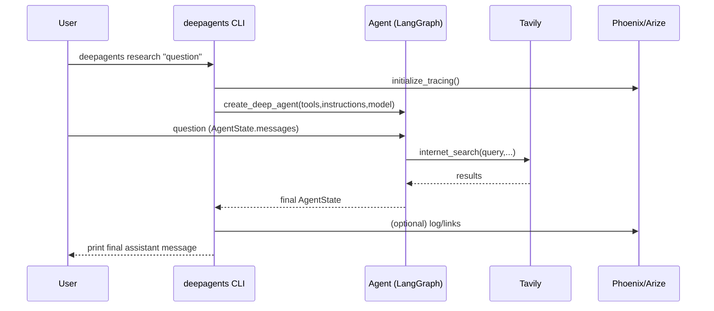
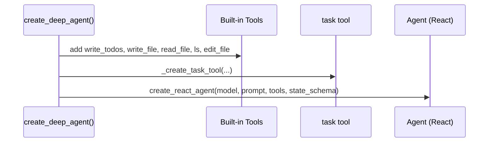
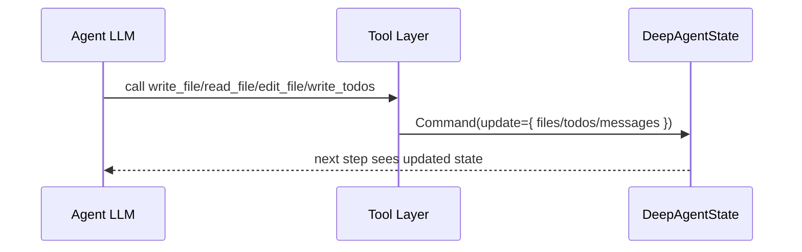
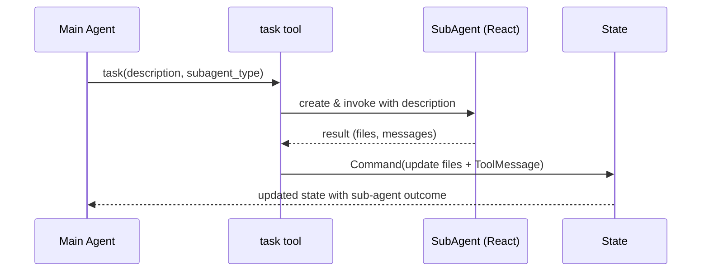
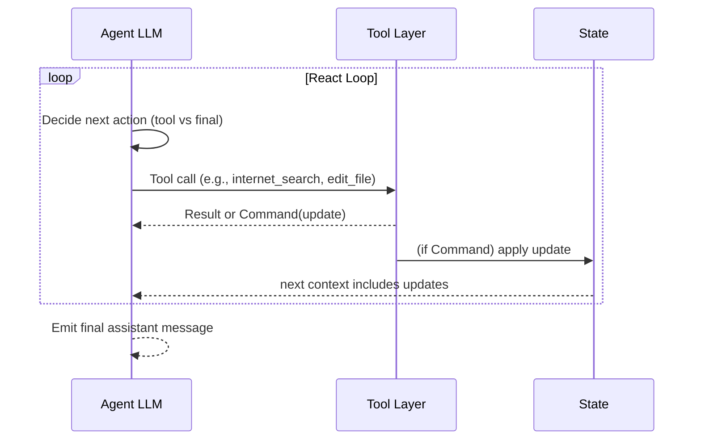
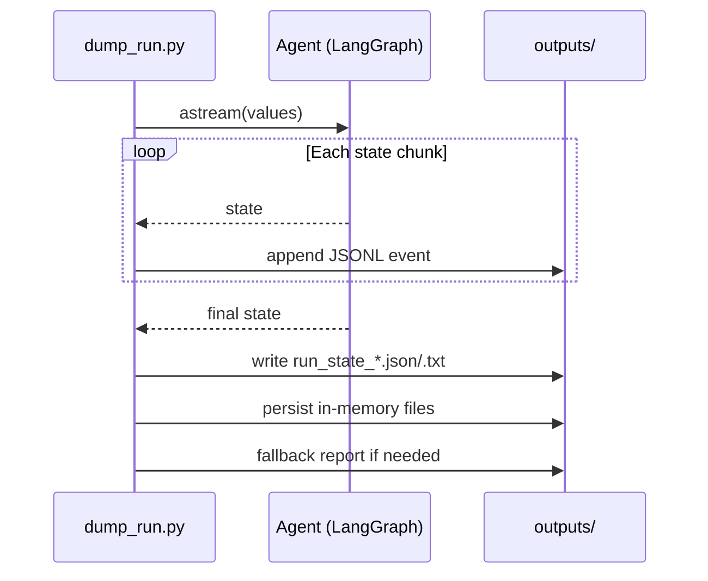

# DeepAgents Research Run: Phases and Internal Flow

This document explains how a research run flows through DeepAgents: from the CLI entrypoint to LangGraph orchestration, tools and in‑memory files, sub‑agents, tracing, and the dump runner streaming pipeline.

Key modules:
- `src/deepagents/cli.py` — CLI entrypoint for `deepagents research`
- `src/deepagents/graph.py` — builds the main agent with tools, prompts, tracing
- `src/deepagents/state.py` — `DeepAgentState` (todos, files reducer)
- `src/deepagents/tools.py` — core tools: `write_todos`, `read_file`, `write_file`, `edit_file`, `ls`
- `src/deepagents/sub_agent.py` — `task` tool for launching sub‑agents
- `examples/research/dump_run.py` — streams agent state and dumps outputs to `outputs/`

Environment:
- `ANTHROPIC_API_KEY` (required), `TAVILY_API_KEY` (required)
- Optional tracing: `ARIZE_API_KEY`, `ARIZE_SPACE_ID`

---

## Phase 1: CLI invocation and setup (`src/deepagents/cli.py`)

- Loads `.env` if present.
- Validates `ANTHROPIC_API_KEY` and `TAVILY_API_KEY`.
- Creates a Tavily tool `internet_search()` bound to CLI options (topic, max_results, include_raw_content).
- Selects Anthropic model via `--model` presets or `--model-name` override.
- Initializes Phoenix/Arize tracing if enabled and prints dashboard URL.
- Calls `create_deep_agent()` with tools, instructions, model, tracing flags.
- Invokes `agent.invoke({"messages": [{"role": "user", "content": question}]})` and prints the final message content.

---

## Phase 2: Agent construction and prompt (`src/deepagents/graph.py`)

- Appends `base_prompt` to CLI `instructions` so the agent knows built‑in tool guidance.
- Adds built‑in tools: `write_todos`, `write_file`, `read_file`, `ls`, `edit_file`.
- Uses `DeepAgentState` by default.
- Builds a `task` tool via `_create_task_tool(...)` to launch sub‑agents.
- Initializes tracing and logs a main agent invocation.
- Returns a `create_react_agent(...)` instance.

---

## Phase 3: State and core tools

State schema (`src/deepagents/state.py`):
- `DeepAgentState` extends LangGraph `AgentState`.
- `todos: list[Todo]` (optional)
- `files: dict[str, str]` with a reducer to merge file maps across steps.

Tools (`src/deepagents/tools.py`):
- `write_todos(todos) -> Command(update={"todos": ..., "messages": [ToolMessage(...)]})`
- `read_file(file_path, ...) -> str` reads from in‑memory mock filesystem in `state["files"]` (with cat -n format output, offset/limit/truncation).
- `write_file(file_path, content, ...) -> Command(update={"files": ..., "messages": [...]})`
- `edit_file(file_path, old_string, new_string, replace_all=False) -> Command(...)` does safe replacements with guardrails and returns a `Command` that updates `files`.
- `ls(state) -> list[str]` lists in‑memory files.

---

## Phase 4: Sub‑agent orchestration via `task` (`src/deepagents/sub_agent.py`)

- `_create_task_tool(...)` constructs a tool `task(description, subagent_type, ...)`.
- On call:
  - Validates `subagent_type` against `agents` (includes `general-purpose` and configured sub‑agents).
  - Creates a sub‑agent with `create_react_agent(...)` and sets `state["messages"]=[{"role":"user","content":description}]`.
  - `invoke()`s the sub‑agent and returns a `Command` merging `files` and a `ToolMessage` with the sub‑agent’s final output.
  - If tracing is enabled for the parent, logs the sub‑agent invocation with a parent/child relationship.

---

## Phase 5: React loop (LangGraph)

- The `create_react_agent` manages the Thought/Action/Observation loop.
- Each tool call returns either a value or a `Command` with partial state updates.
- The reducer in `DeepAgentState` ensures `files` maps are merged across steps.
- The loop continues until the LLM produces a final assistant message.

---

## Phase 6: Dump runner streaming (`examples/research/dump_run.py`)

- Loads `.env`, imports `research_agent.py` to get `agent`.
- Streams the run with `agent.astream(..., stream_mode="values")` and appends each state chunk to `outputs/<ts>__events.jsonl`.
- Final state snapshot is saved to `outputs/run_state_<ts>.{json,txt}` with pretty summaries.
- In‑memory files in `state["files"]` are persisted to `outputs/<ts>__<filename>`.
- If no report file exists, writes the final assistant message to `outputs/<ts>__report.md`.

---

## Practical notes and gotchas

- The mock filesystem is purely in‑memory until persisted by your own code or the dump runner.
- `edit_file` enforces uniqueness unless `replace_all=True` is passed; include surrounding context in `old_string` to avoid ambiguity.
- Sub‑agents are stateless per invocation; pass complete instructions in the `task(description=...)` call.
- Tracing is optional but recommended; see `deepagents tracing-status` and dashboard URL printed by the CLI.

## Where to look in code

- CLI flow: `src/deepagents/cli.py`
- Agent assembly: `src/deepagents/graph.py`
- State and reducers: `src/deepagents/state.py`
- Tools and updates: `src/deepagents/tools.py`
- Sub‑agent orchestration: `src/deepagents/sub_agent.py`
- Run introspection: `examples/research/dump_run.py`
